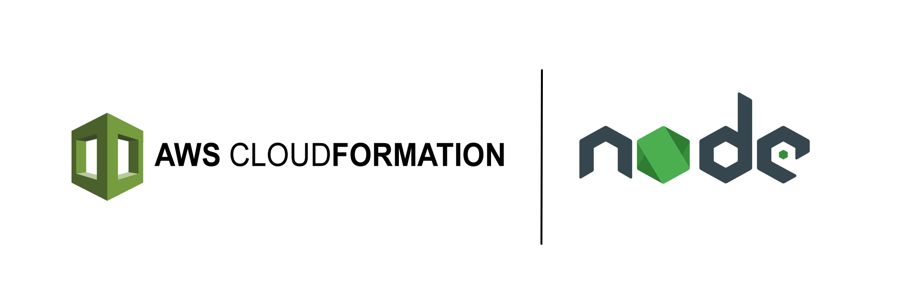

<br />
<p align="center">
  
</p>

# cfn-eval
> A custom resource evaluating inline Node.js code directly inside your Cloudformation templates.

[](https://www.travis-ci.com/HQarroum/cfn-eval)
[](https://www.codefactor.io/repository/github/hqarroum/cfn-eval)

Current version: **1.0.0**

Lead Maintainer: [Halim Qarroum](mailto:qarroumh@amazon.lu)

## 📋 Table of content

- [Features](#-features)
- [Description](#-description)
- [Usage](#-usage)
- [Examples](#-examples)
- [See also](#-see-also)

## 🔖 Features

- Evaluate Javascript code in your Cloudformation stacks using [Node VMs](https://nodejs.org/api/vm.html).
- Improve your day-to-day Cloudformation workflows by using `cfn-eval` as a scripting mechanism for your stacks.
- Seamlessly integrates with Cloudformation variables defined on your custom resource.
- Works for both synchronous and asynchronous code.
- Non-intrusive and can be seamlessly integrated into your own architecture.

## 🔰 Description

This stack exposes a Cloudformation custom resource allowing developers of Cloudformation templates to augment and automate their Cloudformation resources and workflows using simple Javascript code declared inline in their stack and evaluated in a Lambda function as a resource. The custom resource takes standard Cloudformation parameters as an input, evaluates your code, and outputs results which you can then refer to in your Cloudformation template.

This can be particularly handy to script custom behaviors directly in a Cloudformation template when a native intrinsic function is not sufficient for a particular task (for instance, you might want to generate random numbers to create unique identifiers for your resources, perform string transformations, etc.).

## 🛠 Usage

Once you have cloned this repository, you can include it in your Cloudformation stack as follow.

```yaml
# Definition of the evaluation resource stack.
EvaluationResourceStack:
  Type: AWS::CloudFormation::Stack
  Properties:
    TemplateURL: ./cloudformation.yml
```

This will allow you to import the Lambda function associated with the custom resource we create behind the scene, as well as its associated role.

### Inline evaluation example

Below is an example of inline evaluation of Javascript code within your template. This example demonstrates how to manipulate the input (i.e parameters) given to your resource, and generate a dynamic output you can reference in your template.

```yaml
# Definition of a transform resource.
TransformResource:
  Type: Custom::TransformResource
  Properties:
    ServiceToken: !Sub ${EvaluationResourceStack.Outputs.EvaluationResourceFunctionArn}
    Foo: AFooVariableValue
    Code: |
      // The below statement creates a variable holding the string `afoovariablevalue`.
      return ({
        FooLower: props.Foo.toLowerCase()
      });
```

Here, `Foo` is a parameter you declare on your custom resource which is directly referenceable into your inline Javascript code. This provides a handy way in which you can repeatedly write custom scripts to further customize how your template should behave.

The above code variables are referenceable in the outputs of your custom resource. Below is an example of how to reference a produced variable in your stack.

```yaml
Outputs:
  FooLowerOutput:
    Value: !GetAtt TransformResource.FooLower
```

> Note that only variables returned by your code will be made available to your Cloudformation template. You must return an object from your code with attributes to make them available in the outputs of the custom resource.

### Asynchronous code

We've seen above an example of a synchronous Javascript script which be embedded inline into our template. It is also possible to use asynchronous code and get its output in an inline Javascript script. To do so, you need to return a `Promise` which will resolve an object which will be exported by your custom resource.

```yaml
# Definition of an async resource.
AsyncResource:
  Type: Custom::AsyncResource
  Properties:
    ServiceToken: !Sub ${EvaluationResourceStack.Outputs.EvaluationResourceFunctionArn}
    Id: 42
    Code: |
      return (new Promise((resolve, reject) => {
        setTimeout(() => resolve({ foo: `bar-${props.Id}` }), 1 * 1000);
      });
```

In the above example, a new `Promise` is created and generates a result object after 1 second. The resulting object's variables resolved by the script are made available through the custom resources outputs as shown below.

```yaml
Outputs:
  # The below output value will be `bar-42`.
  AsyncOutput:
    Value: !GetAtt AsyncResource.foo
```

### Calling the AWS SDK

If you have a use-case requiring to call the AWS SDK to execute actions on the account, you can require the `aws-sdk` package in your script. To call an AWS API using the AWS SDK you will probably need to associate additional IAM policies to your function. To do so, you can add a specific policy to the role.

```yaml
ResourcePolicy:
  Type: AWS::IAM::Policy
  Properties:
    PolicyName: list-buckets
    Roles:
      - !Sub ${EvaluationResourceStack.Outputs.EvaluationRole}
    PolicyDocument:
      Version: "2012-10-17"
      Statement:
        - Effect: Allow
          Action: s3:ListAllMyBuckets
          Resource: arn:aws:s3:::*
```

This will associate the above policy to the role associated with the lambda function evaluating the code. You will then be able to call the AWS SDK.

```yaml
AsyncResource:
  DependsOn: ResourcePolicy
  Type: Custom::AsyncResource
  Properties:
    ServiceToken: !Sub ${EvaluationResourceStack.Outputs.EvaluationResourceFunctionArn}
    Code: |
      const AWS = require('aws-sdk');

      // Setting the region.
      AWS.config.update({ region: process.env.AWS_REGION });

      // Calling the SDK.
      const res = await new AWS.S3()
        .listBuckets()
        .promise();
      
      // Returning the name of the first bucket in the list.
      return ({ data: res.Buckets[0].Name });
```

This will make available the result returned by `listBuckets` as an output.

```yaml
Outputs:
  AsyncOutput:
    Value: !GetAtt AsyncResource.data
```

## 🎬 Examples

In order to illustrate how this project can be used, several examples have been made accessible in the [examples](examples/) directory. Below is a list of the currently available examples.

- [hashes](examples/hashes/) - A CloudFormation template example demonstrating how to convert given parameters into MD5 and SHA-1 hashes inline into the Cloudformation template.
- [random-generator](examples/random-generator/) - A CloudFormation template example demonstrating how to generate random numbers.
- [to-json](examples/to-json/) - A CloudFormation template example demonstrating how to transform given parameters into a JSON string.
- [http-request](examples/http-request/) - A CloudFormation template example demonstrating how to execute an HTTP request within the inline evaluator function.
- [aws-sdk](examples/aws-sdk/) - A CloudFormation template example demonstrating how to call the AWS SDK.

## 👀 See also

- The [Node.js VM module](https://nodejs.org/api/vm.html) official documentation.
- The AWS documentation on [Custom Resources](https://docs.aws.amazon.com/AWSCloudFormation/latest/UserGuide/template-custom-resources.html).
